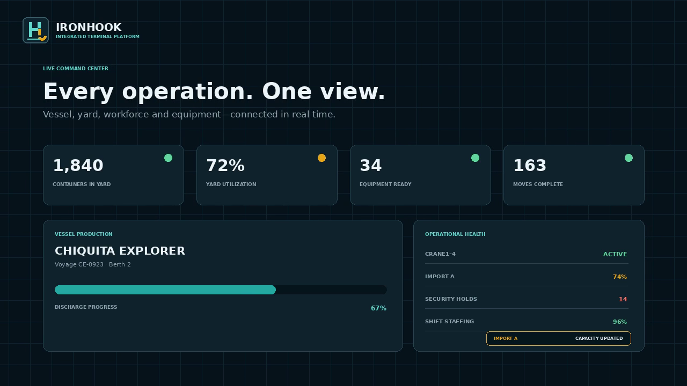

# IronHook v3

IronHook is a beginner-friendly Flask and PostgreSQL training project for terminal container movements.

It includes two browser screens:

*IronHook Command Center connects vessel production, yard capacity, equipment
readiness and operational events in one live terminal view.*
- **Command Center:** live yard capacity, equipment readiness, active dispatch and container tracking.
- **Operator:** a mobile-friendly longshoreman screen for starting assignments, completing moves and stopping work for safety.

The existing Command Center remains available at `/`. The operator screen uses the same assignment API and is available at `/operator`.

## Main files

- `app.py` starts Flask and serves both screens.
- `routes.py` contains the API routes and movement safety rules.
- `db.py` opens PostgreSQL connections.
- `validation.py` validates incoming values.
- `templates/command_center.html` is the Command Center.
- `templates/operator.html` is the mobile operator screen.
- `static/` contains the CSS and JavaScript for both screens.
- `tests/` contains the automated tests.

## Install on a Mac

Open Terminal and move into the project folder:

```bash
cd ~/Projects/IronHook-GitHub/ironhook-api
```

Create a virtual environment:

```bash
python3 -m venv .venv
source .venv/bin/activate
python -m pip install --upgrade pip
python -m pip install -r requirements.txt
cp .env.example .env
```

Set a real `DATABASE_URL`, a long random `SECRET_KEY`, and the existing
credential-signing setting required by the QR workflow.

Create and migrate the database:

```bash
createdb ironhook
python manage.py migrate
python manage.py seed-demo
```

`manage.py migrate` applies the existing v1 database files and the integrated
platform migration in dependency order, recording completed files in
`schema_migration`. `seed-demo` is repeatable and creates configurable yard,
worker self-service and role-based demo records.

Demo usernames are `operator`, `supervisor`, `dispatcher`, `security`, `payroll`
and `admin`. Their local demo password is `IronHookDemo!2026`. Never use this
password outside local demonstration data.

## Run and verify

```bash
python -m pytest -q
python app.py
```

Open [http://127.0.0.1:5000/login](http://127.0.0.1:5000/login). If `PORT` is
changed in `.env`, use that port instead.

## Operational safety rules

- Customs or security holds block container movement.
- Down or maintenance equipment blocks normal moves.
- Restricted equipment requires an authorized credential scan.
- Only the signed-in assigned operator can act on an operator assignment.
- Safety stop remains available during actionable assignment states.
- Completion validates destination availability and commits the move, container,
  equipment and audit updates in one database transaction.
- Inspection clearance removes only the security hold and records who cleared it.
- Sensitive worker and payroll APIs are self-service or role-restricted and use
  no-store browser caching.

## Important files

- `app.py` — application factory, pages and HTTP security controls.
- `auth.py` — sessions, login lockout, audit logging and RBAC decorators.
- `routes.py` — container, yard, workforce, credential and movement APIs.
- `worker_portal.py` — worker-scoped My IronHook APIs.
- `terminal_admin.py` — terminal, yard and user administration APIs.
- `security_operations.py` — cargo risk and inspection workflows.
- `manage.py`, `migrations/` — ordered database migration runner.
- `scripts/seed_integrated_demo.py` — repeatable integrated demo data.
- `tests/` — validation, authentication, RBAC, UI contract and security tests.

This branch must be reviewed and tested before promotion. It is intentionally not
merged into `ironhook-v2` or `main`.
